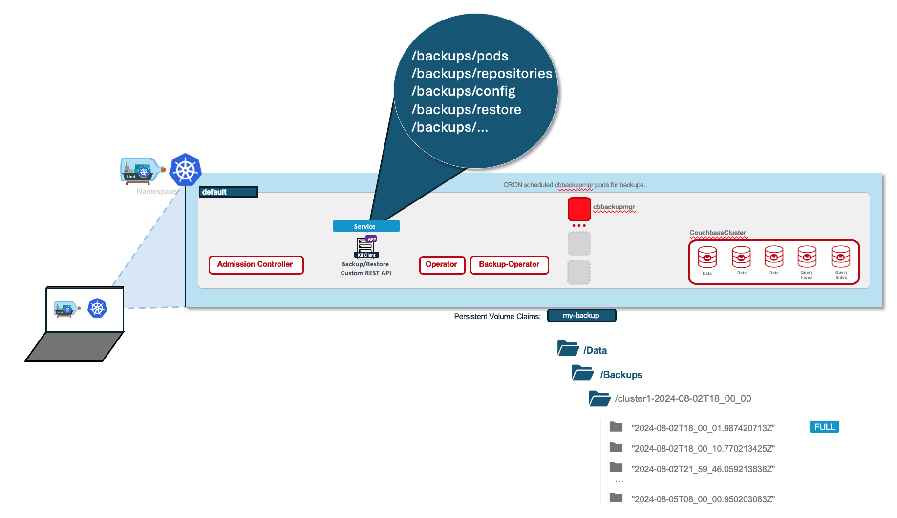

# Kubernetes Client for the Couchbase Autonomous Backup Operator
This repository provides an example of how to use the Fabric8 Kubernetes client with custom Couchbase Operator CRD (Custom Resource Definition) YAML-generated extensions. The goal is to retrieve Couchbase backup resources from a Kubernetes cluster and expose them in a Spring Boot application via a REST API.


## Table of Contents

* Prerequisites 
* Getting Started
* Configuration
* Usage
  * Running the Application
  * Accessing the REST API
* References

## Pre-requisites 
Before you begin, ensure you have the following installed:
* Java 11 or later
* Maven 3.6.x or later
* Docker (for running Kubernetes locally using Minikube or Kind, if needed)
* A running Kubernetes cluster
  * You can create your local cluster using Minikube or [Kind](https://kind.sigs.k8s.io/):
    ```console
    cd getting-started/
    echo "0. starting Kubernetes cluster..."
    kind create cluster --config kind-k8-cluster-3w.yaml
    ```

* Couchbase Operator installed in your Kubernetes cluster
* [jbang](https://www.jbang.dev/) installed on your machine

### Couchbase Cluster Backup Operator Deployment
To install the Couchbase Autonomous Operator, follow the instructions in the Step by step guide to deploy the Couchbase Autonomous Operator & Couchbase Cluster [here](getting-started/README.md)

see more details in [Couchbase documentation](https://docs.couchbase.com/operator/current/install-k8s-operator.html)


## Getting Started
### Configure the Application

#### Maven Dependencies

```maven
        <dependency>
            <groupId>io.fabric8</groupId>
            <artifactId>kubernetes-client</artifactId>
            <version>6.13.1</version>
        </dependency>
        <dependency>
            <groupId>io.fabric8</groupId>
            <artifactId>generator-annotations</artifactId>
            <version>6.13.1</version>
        </dependency>
        <dependency>
            <groupId>io.sundr</groupId>
            <artifactId>builder-annotations</artifactId>
            <version>0.200.0</version>
        </dependency>
```

### Generated Classes from Couchbase Autonomous Operator CRD.yaml file

**1. Generate the classes from the CRD.yaml file:**

```console
mkdir crds
mkdir gen
cp $OPERATOR_HOME/crd.yaml crds/
jbang io.fabric8:java-generator-cli:6.13.1 --source crds --target gen
```

**2. Copy the generated classes to the src folder application:**

```console

```

### Running the Application

```console
mvn spring-boot:run
```

## References


* [https://developers.redhat.com/articles/2023/01/04/how-use-fabric8-java-client-kubernetes](https://developers.redhat.com/articles/2023/01/04/how-use-fabric8-java-client-kubernetes)
* [https://developers.redhat.com/articles/2023/01/04/programming-kubernetes-custom-resources-java](https://developers.redhat.com/articles/2023/01/04/programming-kubernetes-custom-resources-java)