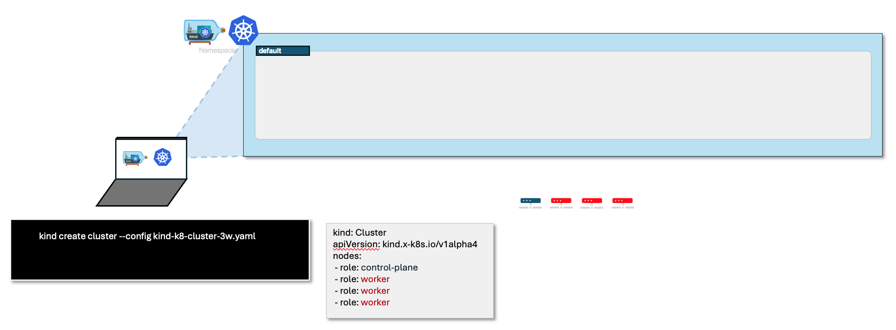
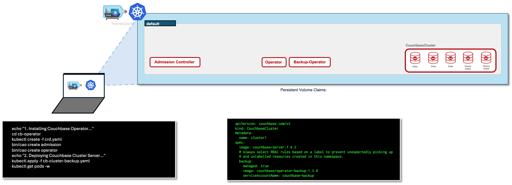

# Overview

This repository details how to backup a Couchbase cluster and restore data in the face of disaster. A conceptual overview of using the Autonomous Operator to backup and restore Couchbase clusters can be found in Couchbase Backup and Restore.

The Autonomous Operator supports two of the backup strategies available in cbbackupmgr: Full Only and Full/Incremental. Complete descriptions and explanations of these strategies can be found in the cbbackupmgr documentation. The examples on this page assume a backup schedule based on the Full/Incremental strategy for both creating backups and performing restores.

---
**Important!**

Backup and restore jobs rely on a shared persistent volume claim (PVC) when in use. On Kubernetes platforms you must specify a value for couchbaseclusters.spec.security.podSecurityContext.fsGroup in order for volume permissions to be the same across all jobs. Red Hat OpenShift is not affected by this constraint.

For further information about setting file system groups see the persistent volume concepts page.

---

## Prerequisites

Before you begin, ensure you have the following installed or using a running Kubernetes cluster:

### 0. Starting Kind as K8 cluster
https://kind.sigs.k8s.io/docs/user/quick-start/



```console
echo "0. starting Kubernetes cluster..."
kind create cluster --config kind-k8-cluster-3w.yaml
```

kind-k8-cluster-3w.yaml

```file
kind: Cluster
apiVersion: kind.x-k8s.io/v1alpha4
nodes:
 - role: control-plane
 - role: worker
 - role: worker
 - role: worker
```


## Getting Started



### 0. Deploying Certificate Manager (Optional if you remove the TLS configuration)
See [Using a Certificate Manager Couchbase Tutorial](https://docs.couchbase.com/operator/current/tutorial-cert-manager.html) and [cert-manager](https://cert-manager.io/) for more information.
```console
echo "0. Deploying Certificate Manager..."
kubectl apply -f https://github.com/cert-manager/cert-manager/releases/download/v1.15.2/cert-manager.yaml
```

### 1. Operator
Download Couchbase Operator & deploy Couchbase CRD, admission controller and operator services. 

```console
echo "1. Installing Couchbase Operator..."
cd $OPERATOR_HOME
kubectl create -f crd.yaml
bin/cao create admission
bin/cao create operator
```

### 2. Grant Backup permissions

```console
echo "2. Granting Backup permissions..."
bin/cao create backup 
```

### 3. Deploy Couchbase Cluster

```console
cd getting-started/samples/backup
echo "3. Deploying Couchbase Cluster Server..."
```
#### 3.1. Creating Couchbase Cluster Users Resources

```console
echo "   3.1. Creating Couchbase Cluster Users Resources..."
kubectl apply -f cb-prod-00-users.yaml
```

#### 3.2. Creating Couchbase Cluster Buckets Resources

```console
echo "   3.2. Creating Couchbase Cluster Buckets Resources..."
kubectl apply -f cb-prod-01-bucket.yaml 
```

#### 3.3. Creating Couchbase Cluster Security (TLS Certificates Configuration) Resources

```console
echo "   3.3. Creating Couchbase Cluster TLS Certificates Resources..."
kubectl apply -f cb-prod-02-security.yaml
```

#### 3.4. Deploying Couchbase Cluster with backup operator Resources

```console
echo "   3.4. Deploying Couchbase Cluster Resources..."
kubectl apply -f cb-prod-03-cluster.yaml
```

See that the CouchbaseCluster resource include the backup section:

```yaml
apiVersion: couchbase.com/v2
kind: CouchbaseCluster
metadata:
  name: cluster1
spec:
  image: couchbase/server:7.6.2
  # Always select RBAC rules based on a label to prevent unexpectedly picking up
  # and unlabelled resources created in this namespace.
  backup:
    managed: true
    image: couchbase/operator-backup:1.3.8
    serviceAccountName: couchbase-backup
   ...
```

### 4. Deploying Backup Plan & Repository Jobs

```console
echo "4. Setting up Backup Plan & Repository Jobs..."
kubectl apply -f cb-prod-04-backup.yaml
```
Note that this sample backup plan includes the backup repository and schedules a full backup every hour and incremental backup every 10 minutes:

```yaml
apiVersion: couchbase.com/v2
kind: CouchbaseBackup
metadata:
  name: my-backup
spec:
  strategy: full_incremental 
  full:
    schedule: "0 * * * *" 
  incremental:
    schedule: "0/10 * * * *" 
  size: 20Gi 
```